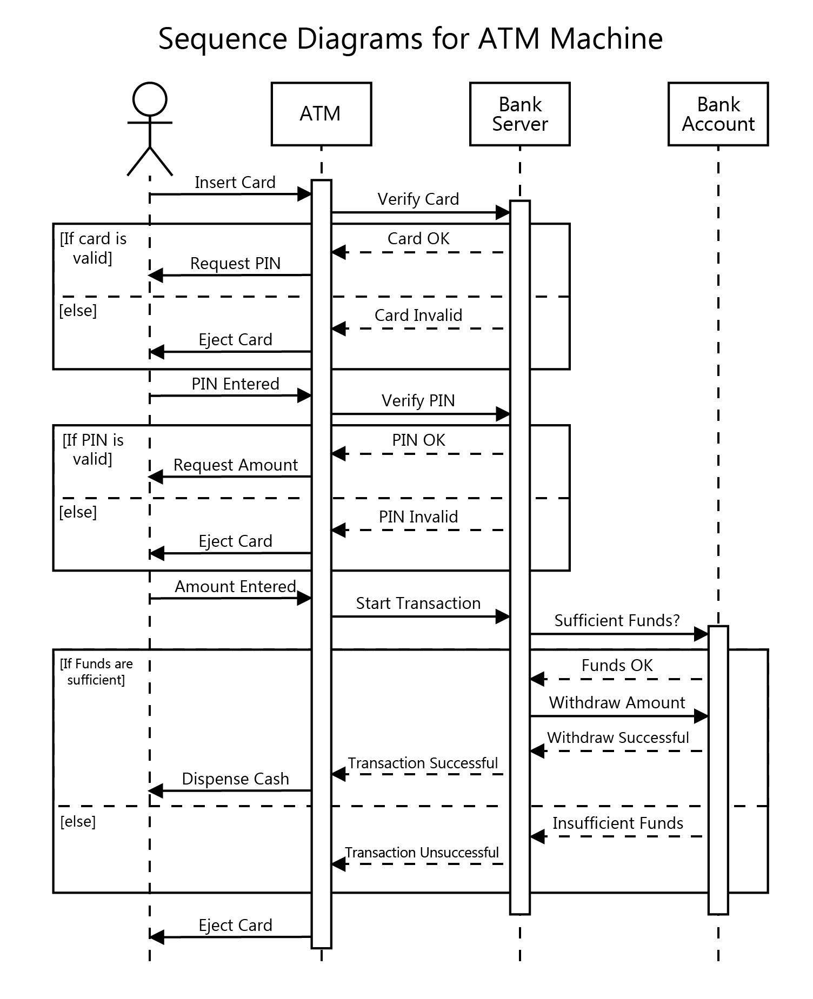

## Sequence Diagram for an ATM Machine
- **Object Oriented & Design Pattern Lab**
- **[Ahnaf Shahrear Khan](https://github.com/ahnafshahrear)**
- **Computer Science & Engineering, University of Rajshahi**
- **Code:** `CSE4122`

### Sequence Diagram

# Technical Report for an ATM Machine
***The following is just the readme version of the original report. To see or download the Technical Report*** **[`click here`](https://github.com/ahnafshahrear/Object-Oriented-Design-And-Design-Patterns-Lab/blob/main/Sequence%20Diagram%20for%20an%20ATM%20Machine/TechnicalReport.pdf)**
### Introduction
- **This technical report outlines the design and operation of an ATM (Automated Teller
Machine) system. The ATM machine is a widely used device in the banking industry, allowing customers to perform various financial transactions, such as cash
withdrawals, account inquiries, funds transfers etc. In this report, we will present a UML (Unified Modeling Language) sequence diagram illustrating the interaction
between an ATM machine and a customer, followed by an explanation of its operating process.**

### Operating Process of the ATM System
1. **_Card Insertion:_ The Customer inserts their ATM card into the machine, triggering the start of the interaction.**
2. **_PIN Entry:_ The Customer enters their PIN securely.**
3. **_Transaction Selection:_ The Customer selects the type of transaction they want to perform, such as "Cash Withdrawal" "Balance Inquiry" or "Fund Transfer".**
4. **_Transaction Validation:_ The ATM sends the transaction details, including the card number, PIN and requested amount to the Bank Server for validation.**
5. **_Bank Server Processing:_ The Bank Server receives the request and authenticates the customer. It checks the account balance and other necessary information.**
6. **_Transaction Authorization:_ If the Bank Server approves the transaction, it authorizes the ATM to proceed. If not, the ATM informs the Customer of the transaction denial.**
7. **_Cash Dispensation:_ For a successful cash withdrawal, the ATM dispenses the requested amount to the Customer.**
8. **_Receipt Printing (Optional):_ Depending on the transaction, the ATM may provide a transaction receipt to the Customer.**
9. **_Transaction Completion:_ The ATM updates the account balance and records the transaction.**
10. **_Card Retrieval:_ The Customer retrieves their ATM card.**

### Conclusion
- **The proposed ATM system is designed to provide a secure and efficient means for customers to perform various financial transactions. The UML sequence diagram and
the operating process overview provide insights into the interaction between the Customer, ATM and Bank Server. This system is an essential part of modern banking
services, enhancing convenience and accessibility for customers while maintaining a high level of security and reliability.**
